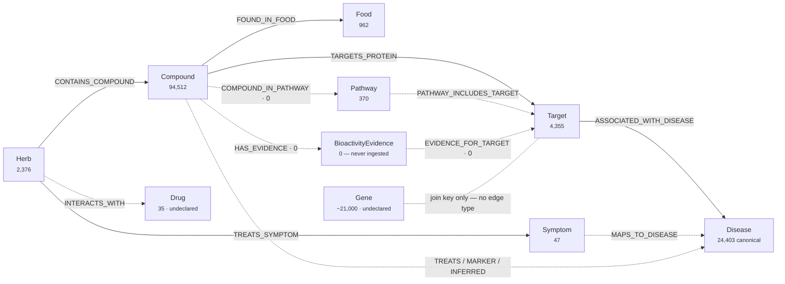
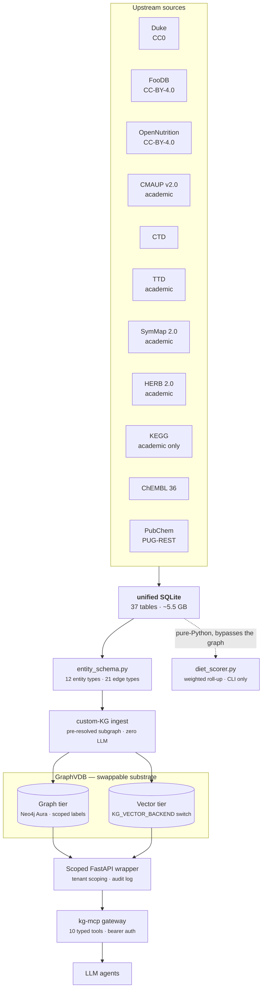
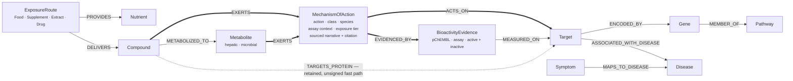

# shrine-bioactivity — graph schema & data construction

> **Design artifact · v2 · 2026-08-01**
> Grounded at commit `db3c740`. Supersedes v1 (same date). v2 incorporates an external design review; §15 records what was accepted and what was qualified.
>
> **Status:** proposal for brainstorming. Nothing here is an approved decision. Amendments marked PROPOSED require an ADR before build.

---

## Nomenclature — read first

Throughout this document **GraphVDB** names the graph-plus-vector retrieval substrate: the component that holds typed entities and edges alongside their embeddings and answers hybrid structural + semantic queries. It is deliberately a *role name*, not a product name.

The substrate is supplied by a third-party framework, subclassed by the scoped wrapper. Which framework is a build-time binding, not an architectural commitment, so it is left unnamed here. On disk the modules implementing it sit under `lightrag/`; every `graphvdb/…` path in this document resolves there today. [A9](#a9--naming) proposes renaming the path to match the role. The vector tier has *already* been abstracted this way via the `KG_VECTOR_BACKEND` switch — the graph tier is finishing a move that is half done.

### State legend

| State | Meaning |
|---|---|
| **LIVE** | Confirmed present in Neo4j Aura |
| **BUILT** | Populated in SQLite; not confirmed deployed |
| **DORMANT** | Query exists, returns 0 rows |
| **DESIGNED** | Declared in schema, no source table |
| **PROPOSED** | New in this document |

---

## 1. The rename is a scope decision, not a string replace

Dropping `diet` from the name widens the mission axis. The provenance doc states the current axis explicitly: *"every node and edge serves the diet ⇄ food ⇄ bioactive compound ⇄ symptom ⇄ disease retrieval objective; the KG is intentionally narrow on this axis."* Several real datasets were **deliberately refused** under that narrowness — the bulk TTD drug-disease table (30K rows) was rejected as *"off-mission per parsimony: drugs aren't diet."*

Generalizing to `shrine-bioactivity` reverses that judgment. Diet becomes one *exposure route* into a compound-centric bioactivity graph, alongside supplement, botanical extract, and drug. That is the right move for a mechanism-of-action knowledge base — MoA is defined on the compound, not on the plate it arrived on — but the parsimony principle that governed six prior ingest decisions has to be formally superseded, not quietly ignored.

> **Recommended.** Write **ADR 0011 — mission axis generalization**, superseding the parsimony clause in `2026-04-29-mcp-gateway-design.md §8.3`. Without it, the next ingest argument re-litigates from scratch and the deferred-sources table stays frozen at a judgment the rename has invalidated.

### Rename debt, measured

This repo has been renamed before and the last one was never finished — `shrine-open-diet` still appears in tracked files, including the live secret-rotation command in `CLAUDE.md`. Counts are tracked files containing each string at `db3c740`:

| String | Files | What it is | Disposition |
|---|---:|---|---|
| `shrine-diet-bioactivity` | 110 | Current repo + nested package + submodule path | Rename target |
| `herbal_botanicals` | 59 | SQLite filename, adapters, tests | Misnames the artifact — it holds foods, targets, diseases, pathways |
| `mcp-herbal-botanicals` | 30 | Pre-unification MCP name in legacy PRPs | Archaeology — leave, or sweep with the rename |
| `shrine-open-diet` | 3 | Prior repo name; one is a live `gh secret set --repo` command | Stale — will fail if run |
| `lightrag/` | 2 paths | Vendored upstream submodule *and* our own module dir, same name | Vendor name in a structural path — see [A9](#a9--naming) |

Beyond files, the rename touches the monorepo submodule gitlink, the Railway app, the Infisical path `/research/shrine-diet-bioactivity`, mirrored GitHub Actions secrets, and the deployed hostname. GitHub redirects the old repo URL, so the rename itself is low-risk; the risk is the *partial* rename, which the `shrine-open-diet` row shows already happened once.

Issue [#8](https://github.com/Syntropy-Health/shrine-diet-bioactivity/issues/8) already proposes renaming the nested Python package (52 files). Landing both in one sweep is cheaper than two migrations, and it is the moment to retire `herbal_botanicals.db` for a name describing the 37 tables it actually holds.

---

## 2. Three tiers, and they do not agree

"The schema" is three different things depending on where you look.

| | Entity types | Relationship types |
|---|---:|---:|
| **Designed** (`graphvdb/entity_schema.py`) | 12 | 21 |
| **Built** (populated SQLite source) | 7 | 11 |
| **Live** (last graph snapshot) | 6 | 6 |

> ### ⚠ Drift — unverified for 3 months
>
> The only graph-state snapshot in the repo (`research-journal/shared/scope-state-snapshot.md`) was generated **2026-04-29** and records exactly 7 relationship types — 6 real plus a legacy `DIRECTED` artifact. Every edge type built afterwards (`MAPS_TO_DISEASE`, the three evidence-typed compound→disease edges, `PATHWAY_INCLUDES_TARGET`) landed in SQLite on 2026-05-07/08. **Nothing in the repo records a re-ingest since.** The 2.92M-row evidence layer, the 24,403 canonical diseases, and the 370 KEGG pathways may exist only in SQLite.
>
> This is stated as unverified rather than confirmed: the Aura and gateway credentials sit in an Infisical project this identity is not a member of. Re-running `graphvdb/generate_snapshot.py` resolves it in minutes and should precede every other decision here.

Drift runs in both directions. The live graph carries two node labels the schema never declares — `Drug` (35 nodes) and `Gene` (~21,000, from SymMap). `INTERACTS_WITH` declares `tgt_type: "Drug"` and `CONTRAINDICATES` declares `Condition|PatientState`, none of which exist in `ENTITY_TYPES`. The schema and the graph each contain things the other does not know about.

---

## 3. Entity schema — 12 declared

| Entity | SQLite source | Key / name | State | Note |
|---|---|---|---|---|
| **Herb** | `herbs` | `scientific_name` | LIVE | 2,376 Duke; ~9,000 Aura nodes across sources |
| **Compound** | `compounds` | `name` | LIVE | 94,512 rows; 0 SMILES, 0 populated PubChem CID |
| **Food** | `compound_foods` | `food_name` | LIVE | 962 nodes; 647 carry `nutrition_100g` JSON |
| **Target** | `targets` | `name` | LIVE | 4,355; UniProt + gene symbol + druggability |
| **Disease** | `diseases_canonical` | `preferred_name` | BUILT | 24,403 canonical; source swapped in Phase 3 |
| **Symptom** | `symptoms` | `name` | LIVE | 47 hand-curated; SymMap holds 1,148 + 2,285 unjoined |
| **BioactivityEvidence** | `bioactivity_evidence` | `id` | DORMANT | ChEMBL rows; Phase 1 ingest never run end-to-end |
| **Pathway** | `kegg_pathways` | `name` | BUILT | 370 human pathways; KEGG academic-licence only |
| **Protocol** | — | `name` | DESIGNED | Tenant API ingest, never built |
| **Intervention** | — | `name` | DESIGNED | |
| **Outcome** | — | `name` | DESIGNED | |
| **Biomarker** | — | `name` | DESIGNED | |
| *Drug* | `hdi_safe_50.json` | — | LIVE | 35 nodes; referenced by `INTERACTS_WITH`, never declared |
| *Gene* | SymMap | — | LIVE | ~21,000 nodes; the graph's most-used join key is not an entity |

Three absences matter, in this order:

1. **No `Metabolite`.** The effector of a dietary compound is frequently not the compound ingested. First-pass and gut-microbiome metabolism produce the actual actor — ellagitannins → urolithin A, daidzein → equol, glucosinolates → sulforaphane — and most polyphenols circulate as glucuronide or sulfate conjugates with materially different bioactivity. Every `Compound —ACTS_ON→ Target` edge inherits a **parent-compound fallacy** for exactly the compound class this graph is richest in. See [A7](#a7--declare-gene-and-drug-add-metabolite-and-nutrient).
2. **No `Gene`.** Gene symbol is the join key behind `PATHWAY_INCLUDES_TARGET`, the 2.89M gene-mediated inference rows, and `targets.gene_symbol`. The graph reasons *through* genes constantly and cannot reason *about* them.
3. **No `Nutrient`.** The mission sentence opens with "macronutrients," yet nutrition lives as a 90-key JSON blob on 647 Food nodes — unaddressable, unjoinable, invisible to traversal.

---

## 4. Edge schema — 21 declared, 6 confirmed live

| Edge | Src → Tgt | Source table | Rows | State | Properties |
|---|---|---|---:|---|---|
| **CONTAINS_COMPOUND** | Herb → Compound | `herb_compounds` | 99,280 | LIVE | plant_part, conc. ppm |
| **FOUND_IN_FOOD** | Compound → Food | `compound_foods` | 4,149,541 | LIVE | content_value, unit, food_part |
| **TARGETS_PROTEIN** | Compound → Target | `compound_targets` | 7,053 | LIVE | activity_value, activity_type |
| **ASSOCIATED_WITH_DISEASE** | Target → Disease | `target_diseases` | 795,434 | LIVE | evidence_layer |
| **TREATS_SYMPTOM** | Herb → Symptom | `herb_symptoms` | 41,823 | LIVE | *none* |
| **HAS_EVIDENCE** | Compound → BioactivityEvidence | `bioactivity_evidence` | 0 | DORMANT | pchembl, activity_type |
| **EVIDENCE_FOR_TARGET** | BioactivityEvidence → Target | `bioactivity_evidence` | 0 | DORMANT | assay_confidence, year |
| **MAPS_TO_DISEASE** | Symptom → Disease | `symptom_disease_map` | 40 / 47 | BUILT | mesh, umls, icd10cm, match_score ≥ 0.5 |
| **COMPOUND_TREATS_DISEASE** | Compound → Disease | `compound_disease_evidence` | 2.92M † | BUILT | pubmed_ids, source |
| **COMPOUND_MARKER_FOR_DISEASE** | Compound → Disease | `compound_disease_evidence` | 2.92M † | BUILT | pubmed_ids |
| **COMPOUND_INFERRED_DISEASE** | Compound → Disease | `compound_disease_evidence` | 2.92M † | BUILT | inference gene, score, pubmed_ids |
| **PATHWAY_INCLUDES_TARGET** | Pathway → Target | `kegg_pathway_genes` | 455 | BUILT | kegg_gene_id, gene_symbol |
| **COMPOUND_IN_PATHWAY** | Compound → Pathway | `kegg_compound_pathways` | 0 | DORMANT | blocked on empty `compound_identity` |
| **INTERACTS_WITH** | Herb → Drug | `hdi_safe_50.json` | 50 | LIVE | **severity, mechanism_class, evidence_tier, citations** |
| **CONTRAINDICATES** | Herb\|Compound → Condition\|Disease… | — | — | DESIGNED | polymorphic; no query defined |
| **INCLUDES** | Protocol → Intervention | — | — | DESIGNED | |
| **USES** | Intervention → Compound | — | — | DESIGNED | |
| **RESULTED_IN** | Intervention → Outcome | — | — | DESIGNED | |
| **MEASURED_BY** | Outcome → Biomarker | — | — | DESIGNED | |
| **INDICATES** | Biomarker → Disease | — | — | DESIGNED | |
| **SYNERGIZES_WITH** | Compound → Compound | — | — | DESIGNED | |

† The three Phase-3 edges partition one 2,922,025-row table by `evidence_type`; the count is the table, not each edge.

---

## 5. The graph as built

Dashed edges are the honest picture: everything built after 2026-05-07 is unconfirmed in the deployed graph, and three edge types return zero rows by construction. The single richest edge in the schema — the only one carrying `mechanism_class`, `severity` and `evidence_tier` — is the 50-row hand-curated herb-drug panel.

---

## 6. Data construction

The construction philosophy is **structured-first**: normalize every source into one SQLite database, then push typed entities and edges into the GraphVDB through its custom-KG ingest call, which bypasses LLM extraction entirely — 100% fidelity, zero token cost. Semantic search is a *vector index layered over* those deterministic edges, not a producer of them.

That ingest call is the one place the substrate leaks into our code. It is a single verb — *write this exact set of nodes and edges, infer none* — and any graph-plus-vector store that accepts a pre-resolved subgraph satisfies it. Keeping the contract that narrow is what makes the substrate swappable.

Note the dashed branch. `diet_scorer.py` — the read-side capstone turning `(food, grams)` into ranked target/disease/pathway predictions — reads **SQLite directly and never touches the graph**. It was kept off the MCP surface to respect a `FORBIDDEN_USECASE_VERBS` thin-adapter constraint. The consequence is that the system's most mechanistically interesting computation is invisible to every agent talking to the gateway.

### Where the semantics leak out

Two losses happen at the SQLite → graph boundary, both in the same direction:

- `compound_targets` has an **`interaction_type`** column. The `TARGETS_PROTEIN` query selects `activity_value` and `activity_type` and **drops it**. The one direction-bearing field in the binding table never reaches the graph.
- `bioactivity_evidence` captures `pchembl`, `value`, `units`, `relation`, `assay_confidence` — a complete potency record with **no action field at all**.

---

## 7. Source ledger

| Source | Licence | Contributes | Last refresh | Commercial |
|---|---|---|---|---|
| Dr. Duke's Phytochemical DB | CC0 | Herb, Compound, Food, Symptom backbone | 2026-04-12 | Clear |
| FooDB | CC-BY-4.0 | 4.13M compound–food edges | 2026-04-12 | Clear |
| OpenNutrition (USDA FDC core) | CC-BY-4.0 | 90-key nutrition on 647 Foods | 2026-04-29 | Clear |
| CMAUP v2.0 | Academic | Targets, compound–target, plant–disease | 2026-04-29 | Restricted |
| SymMap 2.0 | Academic | TCM symptoms, bilingual crosswalk, genes | 2026-04-26 | Restricted |
| HERB 2.0 | Academic | 1.8M herb–disease evidence rows | 2026-04-12 | Restricted |
| TTD | Academic | Literature refs only; bulk table refused | — | Restricted |
| CTD | Public files | 2.92M compound–disease evidence w/ PubMed | 2026-05-08 | Clear |
| KEGG | **Academic only** | 370 pathways, 39,340 pathway–gene links | 2026-05-08 | Licence required |
| HDI-Safe-50 (curated) | Derived, cited | 50 herb–drug edges — the only mechanism-bearing edges | 2026-05-01 | Clear |

> **Provenance drift.** `DATASET_PROVENANCE.md` is stamped **2026-05-01** and documents per-source refresh cadences not exercised since. For a graph whose pitch is evidence-grading, unexercised pins are a credibility gap. [A6](#a6--uniform-provenance-stamp-and-build-gate) makes cadence compliance a build check on the same mechanism as the stamp gate.

---

## 8. The mechanism gap

### 8.1 Potency without polarity

**The graph knows how strongly a compound binds and never what the binding does.**

Every quantitative edge is a magnitude with no sign. `TARGETS_PROTEIN` carries `activity_value`. `BioactivityEvidence` carries `pchembl`, `value`, `units`. None record whether the compound *inhibits*, *activates*, *antagonises*, or merely *occupies*. The only mechanism semantics anywhere in the system is `mechanism_class` on 50 hand-curated herb-drug edges — 50 out of roughly 5 million.

That absence propagates into the read side. `diet_scorer.py` rolls up exposure per target with strictly non-negative weights and no negative-evidence subtraction — its own ADR lists this as an invariant. Two compounds in one meal, one inhibiting a target and one activating it, sum to a *stronger* predicted effect. There is no representation in which they could cancel.

### 8.2 Polarity alone is not enough — the exposure regime problem

Adding action verbs from a drug-pharmacology vocabulary solves the sign and introduces a subtler failure. That vocabulary is validated at **pharmacological doses**. Dietary bioactives operate in a different epistemic regime: most bind weakly and promiscuously, and post-prandial systemic concentrations are typically nM to low µM — frequently orders of magnitude below the IC50/Ki values ChEMBL records.

The consequence is sharp. A graph that faithfully records *"quercetin inhibits PI3K, IC50 = X µM"* and lets an agent traverse that edge will emit chains that are mechanistically correct-looking and physiologically implausible at dietary exposure. Relative to the current unsigned graph, that is **a more legible hallucination substrate** — better-formed claims, no better grounded.

So exposure plausibility is not a downstream generalization of the MoA layer. **It is the validity gate on it.** A `MechanismOfAction` node without a concentration-context qualifier answers "what does binding do in an assay," not "what does this food do in a person" — and the second question is the one in the title.

*Sourcing caveat, stated plainly:* achievable-Cmax data for dietary compounds has **no structured source among the ten currently ingested**. It is scattered across primary pharmacokinetics literature with no ChEMBL-equivalent. A true Cmax join is therefore a data-acquisition project, not a schema change. The v1 that is actually buildable is a coarse ordinal — assay context (cell-free / cell-based / in vivo) plus an assay-concentration bucket — as an exposure-plausibility proxy. [A3](#a3--core-reify-mechanism-of-action-with-context-qualifiers) specifies the qualifier; the Cmax join is named as its own follow-on rather than assumed.

### 8.3 The parent-compound fallacy

Related and equally load-bearing: for a diet-origin graph the effector is often not the ingested compound but a metabolite (§3). Modelling `Compound —ACTS_ON→ Target` without a metabolism hop is systematically wrong for the polyphenol class the graph is densest in. [A7](#a7--declare-gene-and-drug-add-metabolite-and-nutrient) adds `Metabolite` and `METABOLIZED_TO` with a `context: hepatic | microbial` qualifier — with the same sourcing caveat: none of the ten current sources carries these edges.

### 8.4 The reframe — semantic context as driver, with a fidelity constraint

Today the pipeline is structured-first with a semantic index bolted on: SQLite rows become templated description strings, which become embeddings. Natural language is an *output* of the structured layer, and that is precisely why it cannot be wrong in ways the rows are not.

The proposal inverts the dependency. A **mechanism-of-action layer** becomes a first-class, addressable part of the graph, and the quantitative layers (potency, exposure, citation count) attach to it as measurements *of* a stated mechanism. Natural language stops being a rendering of the rows and becomes the interpretable spine the rows are evidence for.

> **Fidelity constraint — non-negotiable.** Narrative and mechanism-text fields are **sourced, never generated.** They come from curated upstream text carried verbatim with its citation, or they do not exist. Any narrative synthesised at query time must be reconstructible from cited edges, and an agent must be able to name the edges it came from.
>
> Without this clause the reframe reintroduces exactly the fabrication surface Paper 1 measured — moved from retrieval time into the knowledge layer, where it is harder to detect. A project whose headline finding is citation fabrication cannot ship an LLM-authored mechanism corpus.

### 8.5 Why this is testable

If the mechanism-gap hypothesis is right, adding signed, tiered, cited, exposure-qualified mechanism edges should **measurably reduce the 40% non-existent-chain citation rate** from Paper 1. That is a clean A/B: same panels, same questions, retrieval with and without the new layers. [A10](#a10--pre-register-the-fabrication-rate-eval-as-the-acceptance-gate) makes it the acceptance gate.

---

## 9. Amendments

### A0 · Prerequisite — re-snapshot, then make drift impossible
**PROPOSED**

Run `graphvdb/generate_snapshot.py` and diff against the 2026-04-29 baseline. Minutes of work; it determines whether every amendment below is an additive migration or sits behind a full re-ingest. Requires Aura credentials from an Infisical project this identity cannot read — the access grant is the actual blocker.

**Then make it a gate, not an event.** The three-tier drift happened because snapshotting is manual. The durable fix is a CI job that diffs snapshot output against a committed baseline and fails on drift. Without it, A0 gets re-proposed in six months under a different name.

*Why first:* eleven of twenty-one edge types have an unknown deployment state. Designing on that is designing on a guess.

### A1 — Activate `compound_identity`
**PROPOSED**

Run the Phase 1 PubChem/UniChem/ChEMBL bridge end-to-end. Built and bug-fixed twice, never executed to completion, so `compound_identity` is an empty schema. Three edge types are dormant behind it and the food ∩ target intersection is stuck at 565 compounds against a ≥1,500 target.

*Unlocks:* `HAS_EVIDENCE`, `EVIDENCE_FOR_TARGET`, `COMPOUND_IN_PATHWAY`; the ChEMBL potency corpus; ADR 0007's own ≥70% cross-ref acceptance gate, still unmeasured.

### A2 — Stop dropping `interaction_type`
**PROPOSED**

One line in the `TARGETS_PROTEIN` query. The column exists in `compound_targets` and is discarded at ingest. Whatever CMAUP's coverage turns out to be, it is the cheapest polarity signal available and establishes the property name the richer MoA layer extends.

### A3 · Core — Reify mechanism of action, with context qualifiers
**PROPOSED** · *absorbs the exposure axis formerly parked in A8*

Introduce **`MechanismOfAction`** — an addressable node that Compound and Target attach to, rather than binding to each other directly. Reification is what lets one compound–target pair hold several competing mechanism claims from different sources without one silently overwriting another.

Required fields, all from day one — retrofitting any of them is a re-ingest:

| Field | Why |
|---|---|
| `action` | Polarity and modality. **Adopt, don't invent** — see below. |
| `pharmacological_class` | Groups mechanisms above the single-target level |
| `species` / `system` | CTD and ChEMBL mix human, rodent and cell-free evidence. A rodent in-vivo agonism claim served to a human question is a silent category error. |
| `assay_context` | cell-free / cell-based / in vivo. Also the cheapest exposure-plausibility proxy (§8.2). |
| `exposure_plausibility` | Ordinal tier: is the assay concentration within reach of dietary intake? v1 is coarse (see §8.2 caveat); the Cmax join is a separate sourcing project. |
| `confidence_tier` | Curation strength, distinct from citation count |
| `narrative` + `citation` | Sourced verbatim, never generated (§8.4) |

Three new edges: `Compound —EXERTS→ MechanismOfAction`, `MechanismOfAction —ACTS_ON→ Target`, `MechanismOfAction —EVIDENCED_BY→ BioactivityEvidence`. The existing `TARGETS_PROTEIN` edge stays as the fast unsigned path so nothing downstream breaks.

**Adopt the action vocabulary, do not invent one.** ChEMBL mechanism `action_type` and the IUPHAR/BPS Guide to PHARMACOLOGY action annotations already exist, are permissively licensed, and give external interoperability. Inventing a seven-verb list that later needs mapping to these is avoidable debt — and inventing one would contradict §13's own advice to prefer open substrates.

**Apply the same reification to interaction claims.** `SYNERGIZES_WITH` as a bare Compound→Compound edge has exactly the defect diagnosed for `TARGETS_PROTEIN`: synergy is a claim about a pair *in a context* (dose ratio, model, endpoint). If the interaction layer is built (Q1), reify it rather than reviving the flat dormant edge.

### A4 — Open substrate first; proprietary as licence-gated enrichment
**PROPOSED**

Populate the MoA layer from ChEMBL MoA tables and IUPHAR/BPS first — thinner than a proprietary source, but clear-licence and already the vocabulary authority under A3. Treat a DrugBank-class source as *enrichment on top of* that spine, following the KEGG precedent exactly: one build-time entry point, one toggle, an explicit provenance entry, a documented degradation path when the licence is absent.

*Why this order:* a clear-licence spine with proprietary enrichment degrades gracefully. The reverse does not — and six of ten current sources are already academic-only.

### A5 — Weight at query time; never stamp policy onto data
**PROPOSED** · *rewritten in v2 — the earlier form was wrong*

The five weights in `diet_scorer.py` (direct binding 1.00, therapeutic 0.90, marker 0.70, gene-inferred 0.50, pathway 0.60) encode a real epistemology and are invisible to retrieval. v1 of this document proposed stamping them as an `evidence_weight` edge property at ingest. **That conflates provenance with policy and should not be built.**

- **Provenance** — where an edge came from, with what citations and qualifiers — is a fact about the edge. It belongs on the edge, mandatory ([A6](#a6--uniform-provenance-stamp-and-build-gate)).
- **Scoring policy** — how much an evidence type counts — is model- and version-dependent. Epistemologies get revised. Stamped, every weight change becomes a re-ingest, and two tenants with different risk postures cannot disagree.

The correct split: A6 stamps raw attributes; the scorer reads attributes and applies weights **at query time**, with the weight set exposed as a **versioned parameter** and overridable per tenant. The scoped wrapper already enforces tenant scopes, so the mechanism for divergent postures exists.

This also answers Q4: yes, the scorer should move onto the graph — as a traversal-plus-weighting function over well-attributed edges, not as baked-in numbers.

### A6 — Uniform provenance stamp and build gate
**PROPOSED**

Today `pubmed_ids` exists on the Phase-3 evidence edges (94% fill) and nowhere else; `TREATS_SYMPTOM` carries no properties whatsoever. Require on every ingested edge: `source`, `evidence_tier`, `citation`, plus `assay_type` and `species` where applicable — with a build gate that fails on unstamped edges. This is the precondition for a cite-or-abstain retrieval contract.

Add `licence_tier` alongside (§13), so a tenant scope can filter to commercially-clear edges at query time.

Same mechanism, second check: **refresh-cadence compliance** (§7) as a build gate, so stale pins fail loudly rather than sitting in a doc.

### A7 — Declare `Gene` and `Drug`; add `Metabolite` and `Nutrient`
**PROPOSED** · *`Metabolite` promoted to headline in v2*

- **`Metabolite` + `METABOLIZED_TO`** with `context: hepatic | microbial`. Without it the MoA layer inherits the parent-compound fallacy from the occurrence layer (§8.3). Schema is the easy half — none of the ten current sources carries these edges, so this implies an ingest project.
- **`Gene`** — already live as ~21,000 undeclared nodes and the graph's most-used join key. Regularise it; under a generalized mission it becomes the natural mechanistic hub.
- **`Drug`** — already live as 35 undeclared nodes referenced by `INTERACTS_WITH`. Under the rename it is a peer exposure route, not an exception.
- **`Nutrient`** — promote out of the `nutrition_100g` JSON blob: 90 keys on 647 Foods, currently unaddressable, in a graph whose mission sentence begins with "macronutrients."

### A8 — Generalise Food to `ExposureRoute`
**PROPOSED** · *scope reduced in v2 — the exposure qualifier moved into A3*

Food is one way a compound enters a body, alongside supplement, standardised extract and drug. Keep Food as a subtype; introduce the parent so dose and matrix attach to the route rather than being hard-coded to the dietary case. The *plausibility qualifier* that gates mechanism claims is now A3's responsibility; A8 is the carrier that makes it computable per route.

### A9 · Naming — `lightrag/` → `graphvdb/`
**PROPOSED**

A vendor name sits in a structural path twice over: the vendored upstream submodule and our own module directory are both called `lightrag/`, so *which one* is a question every reader of the tree must answer. Rename our module to `graphvdb/`, leave the vendored submodule under its real upstream name, and let the directory boundary state which code is ours.

The coupling to abstract is thin: ingest is one call, read is the scoped wrapper plus the query modes, and the vector tier is already vendor-neutral via `KG_VECTOR_BACKEND`.

*Caveat:* a role name only earns its keep if the boundary is enforced. Pair it with a thin interface module and a test that fails on direct vendor imports outside it, or `graphvdb/` is a rename that buys nothing.

### A10 — Pre-register the fabrication-rate eval as the acceptance gate
**PROPOSED** · *new in v2*

Paper 1 measured a 40% non-existent-chain citation rate and a 0.66 citation-faithfulness score. **That metric is the natural success criterion for this entire program.** Pre-register it: same panels, same questions, retrieval with and without the A2/A3/A6 layers, with the target and the analysis fixed before the run.

Without this, the risk is shipping a beautiful mechanism layer whose effect on agent faithfulness is never measured — the same "unexercised pins" credibility gap flagged for provenance in §7.

*Costs, named honestly:* it requires freezing the 40×7 gpt-oss-120b matrix as a regression baseline, and re-running consumes real inference budget. It is also only interpretable after A0 and A2 — if the two open gateway defects (degraded NL retrieval, 400 on neighbourhood queries) are still live, part of the 13/40 "cited when retrieval returned nothing" is explained with no MoA hypothesis at all.

### A11 — Ingest negative and inactive results
**PROPOSED** · *new in v2*

Two one-sidedness problems compound each other:

- **Citation count imports publication bias.** `pubmed_ids` at 94% fill is good provenance, but count-of-citations as a weight input rewards positive results, which are cited more. The diet scorer's `citation_factor` uses exactly this.
- **Negative and inactive assays are absent from the schema entirely.** ChEMBL carries inactive rows. Ingest them, or the polarity layer added by A3 is itself one-sided — it will record that compounds act and never that they were tested and did not.

---

## 10. Program order

Dependency-ordered, revised in v2 to put provenance before mechanism and exposure inside it:

| # | Amendment | Why here |
|---|---|---|
| 1 | **A0** re-snapshot + drift gate | Everything downstream is designed on a guess until this lands |
| 2 | **A1** activate `compound_identity` | Unblocks three dormant edge types and the ChEMBL corpus |
| 3 | **A2** stop dropping `interaction_type` | One line; the cheapest polarity signal; sets the property name |
| 4 | **A6** provenance stamp + build gate | Mechanism claims are worthless unattributed — attribution must precede them |
| 5 | **A3** (+A8) MoA with exposure and context qualifiers | The core; qualifiers are cheaper now than as a retrofit |
| 6 | **A11** negative/inactive results | Lands with A3 or the polarity layer ships one-sided |
| 7 | **A4** open substrate, then licensed enrichment | Vocabulary authority is an A3 input; licensed layer is additive |
| 8 | **A5** query-time weighting | Needs A6's attributes to weight over |
| 9 | **A7** entity regularisation + `Metabolite` | `Metabolite` implies its own ingest project; sequence accordingly |
| 10 | **A9** naming | Rides the repo-rename sweep |
| — | **A10** pre-registered eval | Registered *before* step 5; measured after |

---

## 11. Target schema

Two load-bearing changes. The double arrows replace a single unsigned edge with a **claim** that has an action, a species, an assay context, an exposure tier, a sourced narrative and its own citations — and that can coexist with a contradicting claim instead of overwriting it. And `Metabolite` also `EXERTS`, so the effector of a dietary compound can be modelled as the thing that actually acts.

---

## 12. Qualitative ⇄ quantitative

| Qualitative — the interpretable spine | State |
|---|---|
| Action semantics, adopted vocabulary | PROPOSED |
| Pharmacological class, sourced narrative | PROPOSED |
| Species / assay context / exposure tier | PROPOSED |
| Metabolism context (hepatic, microbial) | PROPOSED |
| `mechanism_class` on herb–drug edges | LIVE · 50 edges |
| Entity descriptions rendered for embedding | LIVE |
| Ontology anchors — MeSH, UMLS, ICD-10, HPO | BUILT |
| Bilingual EN/CN/Pinyin herb crosswalk | LIVE |

| Quantitative — the measurement layer | State |
|---|---|
| pChEMBL, IC50/Ki, assay confidence | DORMANT |
| Binding `activity_value` | LIVE · 7,053 |
| Compound content per food, mg/100 g | LIVE · 4.15M |
| Gene-mediated inference score | BUILT · 2.89M |
| PubMed citation counts | BUILT · 94% fill *(publication-biased — A11)* |
| Exposure roll-up from grams consumed | BUILT · CLI only |
| Negative / inactive assay results | ABSENT |
| Achievable Cmax, bioavailability, dose–response | ABSENT · no structured source |

The asymmetry is the point. The quantitative column is populated or one ingest away; the qualitative column is 50 curated edges and a set of templated strings. A mechanism-of-action knowledge base is mostly the left column, and the left column is where almost nothing has been built.

---

## 13. IP posture for a proprietary MoA layer

Six of ten ingested sources are academic-use-only and KEGG is explicitly commercial-licence-required. A proprietary MoA layer makes the licence question structural rather than incidental.

- **Keep the KEGG precedent.** One build target per restricted source, one toggle, a documented degradation path. A commercial deployment builds without them and loses coverage rather than shipping a breach.
- **Stamp `licence_tier` on the edge** (A6), so a tenant scope filters to commercially-clear edges at query time.
- **Separate ingest from redistribution.** Deriving mechanism claims and serving them through an MCP gateway is a different licence question from mirroring the source. Counsel review before the first proprietary overlay lands, not after.
- **Prefer the open substrate** — ChEMBL MoA and IUPHAR/BPS carry action-type data permissively. A4 makes this the default rather than the fallback.

---

## 14. Open questions

1. **"Interactivity" — which one?** *Interaction knowledge* (herb–drug, synergy, contraindication) extends the HDI panel and the dormant types into a real layer — and per A3 should be reified, not flat. *Interactive querying* is a gateway concern that barely touches schema. This document assumes the first.
2. **Does the rename widen ingest scope now or later?** Generalizing reopens bulk TTD and the deferred TCMSP / STITCH / DisGeNET / BATMAN-TCM tier. Refusing them under a name that no longer says "diet" is incoherent. A dated ADR either way suffices.
3. **How much proprietary MoA, and when?** A4 says open substrate first. Confirm that the licensed layer is enrichment rather than foundation before any procurement conversation.
4. **Should the scorer move onto the graph?** A5 answers yes — as query-time weighting over attributed edges. Worth its own ADR because it reverses the thin-adapter constraint that kept the scorer off the MCP surface.
5. **Is the exposure-plausibility tier worth building before a real Cmax source exists?** §8.2 argues the coarse proxy is worth it because retrofitting the field is a re-ingest. The counter-argument — that a coarse tier gives false confidence — deserves a hearing.
6. **Who owns the fabrication-rate baseline?** A10 requires freezing the 40×7 matrix as a regression artifact with a budget for re-runs. That is an ongoing cost, not a one-off.

---

## 15. Review response

External review received 2026-08-01. Accepted in full:

- **A5 was wrong.** Stamping scoring weights at ingest conflates provenance with policy, makes every weight revision a re-ingest, and prevents two tenants from disagreeing. Rewritten as query-time weighting over A6 attributes with a versioned, tenant-overridable weight set. The review is right that v1's A5 and A6 partly contradicted each other and that A6's discipline should win.
- **Exposure plausibility is a validity gate, not a generalization.** Promoted from A8 into A3's required fields. The "more legible hallucination substrate" framing is the sharpest point in the review and is now §8.2.
- **`Metabolite` outranks `Nutrient`.** The parent-compound fallacy is the biologically load-bearing absence for a diet-origin graph. Promoted to A7's headline with a `METABOLIZED_TO` edge and context qualifier.
- **Adopt the action vocabulary, don't invent it.** Inventing a seven-verb list contradicted this document's own §13 advice. ChEMBL `action_type` / IUPHAR-BPS are now A3's authority.
- **Species and assay context from day one.** Both added to A3; retrofitting either is a re-ingest.
- **Reify `SYNERGIZES_WITH` too.** Same defect, same fix; noted in A3 and Q1.
- **The narrative-source question.** §8.4 now carries an explicit non-negotiable: mechanism text is sourced, never generated. The review is right that v1's phrasing could be read either way and that one reading contradicts Paper 1's central finding.
- **A0 should be a gate.** CI drift check added.
- **Publication bias and missing inactives.** New A11.
- **Cadence as a build check.** Folded into A6.

Accepted with a qualification:

- **Exposure plausibility (§8.2).** The gate is right; the data is not there. Achievable-Cmax for dietary compounds has no structured source among the ten ingested, so v1 must be the coarse assay-context proxy the review itself suggests, with the Cmax join named as a separate acquisition project. Stating this matters — otherwise the gate reads as a schema change when it is partly a sourcing problem.
- **`Metabolite` (A7).** Same shape: the schema is the easy half. Microbial and phase-II metabolism edges are in none of the current sources, so A7 implies an ingest project and is sequenced accordingly in §10.
- **A10 eval gate.** Adopted, with costs named: it requires freezing the 40×7 gpt-oss-120b matrix as a regression baseline and consumes inference budget per run — and it is only interpretable once A0 and A2 have separated the retrieval-defect confounder.

No disagreement recorded on: the rename analysis, ADR 0011 first, or the core diagnosis.

---

## 16. Provenance

**How this was grounded.** Entity and relationship counts read from `graphvdb/entity_schema.py` at commit `db3c740`. Row counts from `docs/KG_COMPLETENESS_AUDIT.md` Phase 2–5 closeouts and ADRs 0007–0010. Live-graph state from `research-journal/shared/scope-state-snapshot.md`, generated 2026-04-29 — the most recent snapshot in the repo. Source licences and refresh dates from `docs/DATASET_PROVENANCE.md`, stamped 2026-05-01. Name-debt counts from `git grep -l` over tracked files. Gateway health verified live: `GET /health` → 200.

**On naming.** `GraphVDB` is this document's role name and is not yet a name in the codebase — see the nomenclature note and A9. Every `graphvdb/…` path resolves to `lightrag/…` in the tree at `db3c740`.

**What is not verified.** The current contents of the Neo4j Aura instance. Credentials live in an Infisical project this identity is not a member of, so every LIVE state is as-of the 2026-04-29 snapshot and every post-Phase-2 edge is marked BUILT rather than LIVE for that reason. A0 exists to close this gap first.
